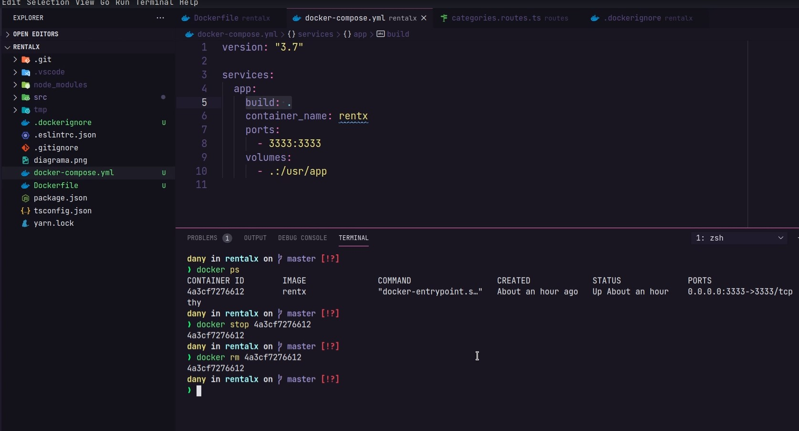

# Conhecendo o Docker
## O que é?
* Ferramenta para criação de containers 
* Container : Ambiente isolado que executa uma imagem
* Imagens: Aplicação empacotada para executar 
* O que rodar localmente rodará em produção 
* Mesmo SO, compartilhando recursos da maquina host.


# Adicionando o Docker ao projeto

* Verificando a versão instalada:

```properties bash

docker -v 

```

* criar Dockerfile na Raiz do projeto 

```DSL
FROM node

WORKDIR /usr/app

COPY package.json ./

RUN npm install

COPY . .

EXPOSE 3333

CMD ["npm", "run", "dev"] 

```
* [imagens oficiais do hub.docker](https://hub.docker.com/search?type=image)
* Criar .dockerignore 

```dockerfile
node_modules
.git
.vscode
```
* No terminal depois de startar o aplicativo do Docker para criar a imagem docker:

```properties bash

docker build -t rentx .

```
* Para rodar a img mapeando as portas(-p): 

```properties bash

docker run -p 3333:3333 rentx

```

* Ver containers disponíveis:

```properties bash

docker ps

docker ps -a

```
* Acessar container no docker: 
  
```properties bash

docker exec -it [nome_container] //bin//bash

```


* E para continuar rodando o compose mesmo depois do Ctrl + C:
  
```properties bash

docker-compose up -d

```
* Ver o que está executando:
  
```properties bash

docker logs [nome-do-container] -f

```
* Remover container(precisa estar com container pausado): 
  
```properties bash

docker rm [id-do-container ou nome]

```
* Iniciar container:

```properties bash

docker start [id-do-container ou nome]

```
* Parar container:
  
```properties bash

docker stop [id-do-container ou nome]

```
* Verificar Ip do container:
* 
```properties bash

docker inspect --format='{{range .NetworkSettings.Networks}}{{.IPAddress}}{{end}}' [$INSTANCE_ID]


```

---
## Docker Compose

* Criar na raiz do diretório `docker-compose.yaml` ⚠️ **ATENÇÃO À INDENTAÇÃO** ⚠️

```yaml

version: "3.7"

services: 
  app: 
    build: .
    container_name: RentaLX
    ports: 
      - 3333:3333
    volumes: 
      - .:/usr/app

```

* E para subir o docker compose:

```properties bash

docker-compose up

```

* Parar o container do docker compose:

```properties bash

docker-compose stop

```
⚠️⚠️⚠️⚠️⚠️
* Para deletar um container no docker compose:

```properties bash

docker-compose down

```
  
  * Recriar container com Docker compose: 

```properties bash

docker-compose up --force-recreate

```
* Testar migrations do container:
* 
```properties bash

yarn typeorm migration:run

```


[ >> Ver mais Aqui <<](https://docs.docker.com/compose/)

* Orquestrador de containers
* Permite definir quais serviços são necessários para aplicação rodar, se algum serviço possuí outras dependências 
* Consegue passar outras configurações, variáveis de ambiente, etc

---
>> Material fornecido pela rockeseat:

Faaaala Dev!
Nesse guia veremos como instalar o Docker e Docker Compose nos principais sistemas operacionais.

# Instalação do Docker na máquina

O Docker é uma ferramenta sensacional que nos permite pular as etapas chatas de configuração de serviços para nossa aplicação. Além disso, ele permite reaproveitarmos o Kernel da máquina hospedeira entre vários serviços executados simultaneamente, conhecidos como containers.

Para iniciar a instalação do Docker vamos prosseguir para a seção "Get Started" presente no site da ferramenta: 

[Get Started with Docker | Docker](https://www.docker.com/get-started)

---

## Windows (64 Bit)

O Docker no Windows possui alguns requisitos: 

- Microsoft Windows 10 Professional  ou Enterprise 64-bit
- Caso você possua o Windows 10 Home 64-bit também é possível usar o Docker mas será necessário instalar o WSL2 também (o instalador já se encarrega disso para você)

<aside>
⚠️ Caso você possua o Windows 32-bit, não será possível realizar a instalação do Docker.

</aside>

<aside>
⚠️ Para que o restart da aplicação funcione corretamente ao salvar o código, é preciso que o projeto esteja na partição do Linux (WSL).

Para mais informações: [Docker Docs - Windows - Best Practices](https://docs.docker.com/desktop/windows/wsl/#best-practices)

Outra alternativa é adicionando a flag `--poll` no script `"dev"`.

</aside>

Caso tenha todos os requisitos, então faça a instalação do Docker para Windows:

[Docker Desktop for Mac and Windows | Docker](https://www.docker.com/products/docker-desktop)

Depois de instalar o Docker e abrir o software você já está pronto para continuar. Lembrando que essa versão do Docker para Windows tem uma interface visual muito bacana, ou seja, você pode usar a interface para visualizar os serviços sendo executados, logs, imagens e muito mais.

Para verificar que o Docker foi instalado corretamente, em **uma nova janela** do terminal execute:

```bash
docker version
```

---

## Mac OSX

No macOS o processo de instalação do Docker é extremamente simples, você precisa apenas baixar o app executável e executa-lo na máquina para iniciar o Docker:

[Docker Desktop for Mac - Docker Hub](https://hub.docker.com/editions/community/docker-ce-desktop-mac)

Depois de aberto você pode garantir que o Docker foi instalado corretamente executando o comando abaixo em uma nova janela do terminal:

```bash
docker version
```

---

## Linux (Ubuntu/Debian)

No Linux, vamos instalar o Docker utilizando o `apt`, para isso, em seu terminal, execute os comandos abaixo:

```bash
sudo apt update
sudo apt remove docker docker-engine docker.io
sudo apt install docker.io
```

Agora com o Docker instalado, vamos habilitar para que seu serviço seja iniciado automaticamente com o sistema:

```bash
sudo systemctl start docker
sudo systemctl enable docker
```

Para garantir que o Docker foi instalado da forma correta, execute no terminal:

```bash
docker version
```

<aside>
💡 Você precisará executar todos comandos do Docker utilizando o `sudo`, mas caso queira executa-los sem o `sudo`, utilize [esse guia](https://docs.docker.com/engine/install/linux-postinstall/#manage-docker-as-a-non-root-user).

</aside>

# Instalação do Docker Compose

Como visto durante as aulas, o Docker Compose precisará ser instalado apenas no Linux, já que nos demais sistemas ele já vem instalado junto com o Docker.

## Linux (Ubuntu/Debian)

- Rode o seguinte comando para instalar o Docker Compose:

```bash
sudo curl -L "https://github.com/docker/compose/releases/download/1.28.5/docker-compose-$(uname -s)-$(uname -m)" -o /usr/local/bin/docker-compose
```

- Aplique as permissões necessárias ao binário:

```bash
sudo chmod +x /usr/local/bin/docker-compose
```

Após isso, rode o comando `docker-compose --version` para assegurar que a instalação foi um sucesso. Caso retorne algum erro (mesmo reiniciando o terminal), crie um link simbólico para `usr/bin` com o seguinte comando:

```bash
sudo ln -s /usr/local/bin/docker-compose /usr/bin/docker-compose
```

Por fim, teste novamente com o comando `docker-compose --version` para checar se está tudo funcionando.

---