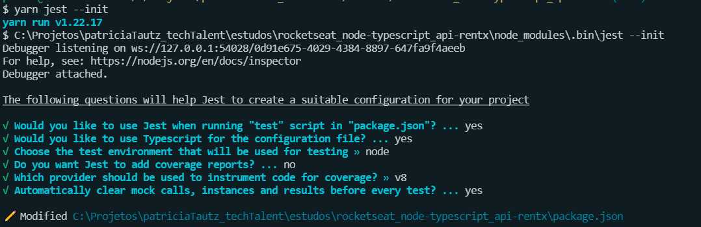

# Tipos de testes

## 1 - Testes unitários 

* Testar pedaços da aplicação - Testes de serviços, de **`regras de negócio`**, exatamente da funcionalidade
* Garantir que a lógica do negócio esteja bem definida e correta, que atenda tanto os casos de sucesso, quanto os casos de erro.

## 2 - Testes de integração
* Testar aplicação inteira - **`todo o processo`**, por exemplo, desde quando a rota é chamada até o retorno que a requisção vai ter, fluxo completo da aplicação. Testar a conexão com o banco de dados(banco de teste), chama serviços externos, APIs, bibliotecas, testar a chamada pro serviço.

  🔄 👉 routes  👉 controllers  👉 useCases  👉 repository 🔄 
  🔄 repository 👈 useCases 👈 controllers 👈 routes 🔄 

  ## TDD - Metodologia para fazer testes  - Test Driven Development -
  ⚠️ Não adianta ter 100 % de cobertura de testes se o teste não for bem escrito - validar de fato regras e casos de negócio ⚠️

  * Começar pela lógica da aplicação

## Criação de teste - 

- [instalação de dependências: Jest](https://jestjs.io/pt-BR/docs/getting-started)

```properties bash 

yarn add jest @types/jest -D

```

- Inicializando o Jest

```properties bash 
yarn jest --init

```



- Adicionar preset para trabalhar junto com o jest 

```properties bash 

yarn add ts-jest -D

```

- No jest.config procurar pela propriedade `preset` descomentar e trocar para :

```ts

preset: "ts-jest"

```

- Ainda no jest.config passar o mapeamento das classes que vamos fazer os testes, 

```ts
// parar ou não após o primeiro erro
bail: true,

// mapeia todas as pastas e procurar arquivos que finalize com a palavra spec.ts
 testMatch: ['**/*.spec.ts']

```

## TDD :

* Inicialmente escrever teste da forma mais simples possível 

* Primeiro o teste vai falhar...

* Depois fazemos o teste passar de maneira simplificada...

* Depois refatorar o Teste conforme validações de RN e RF


