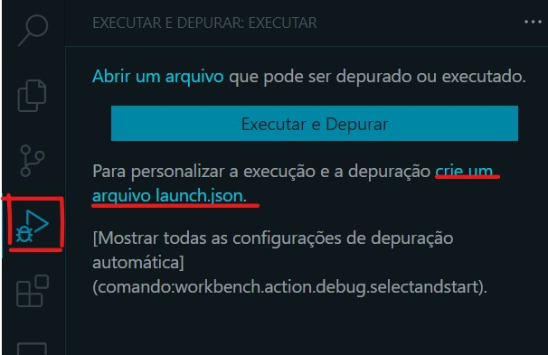
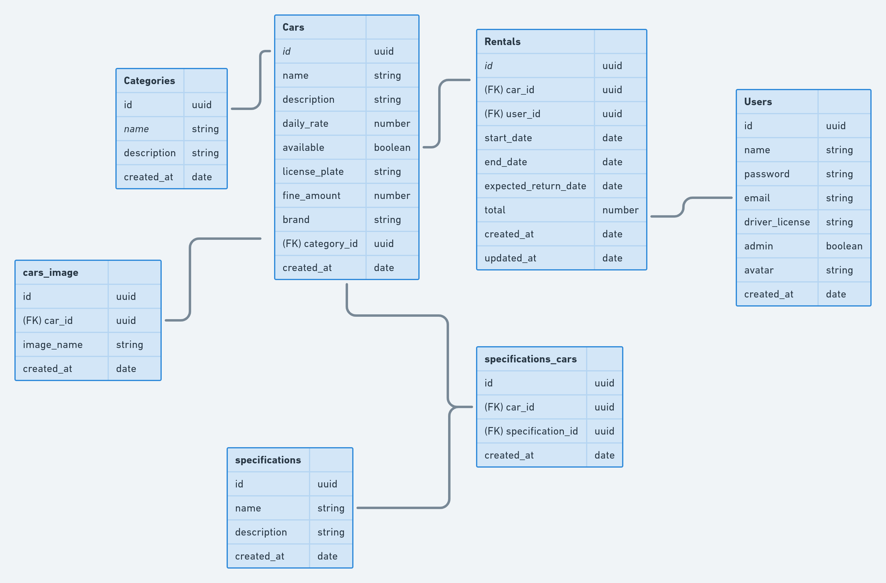
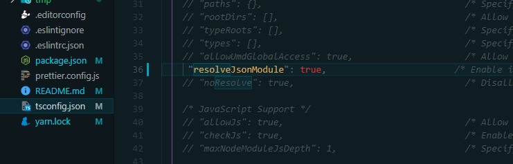
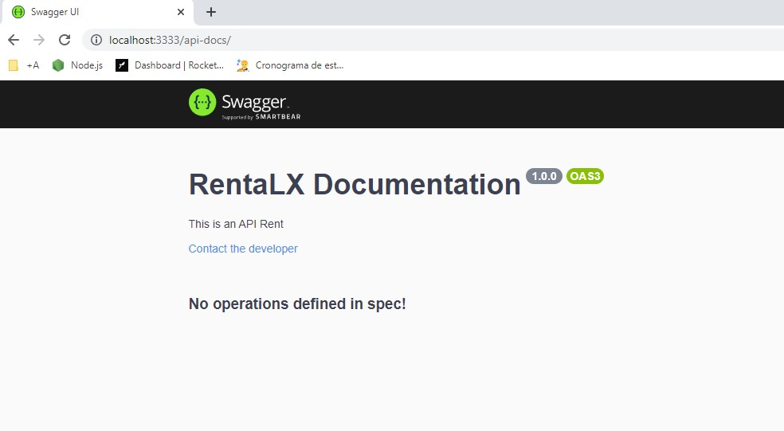
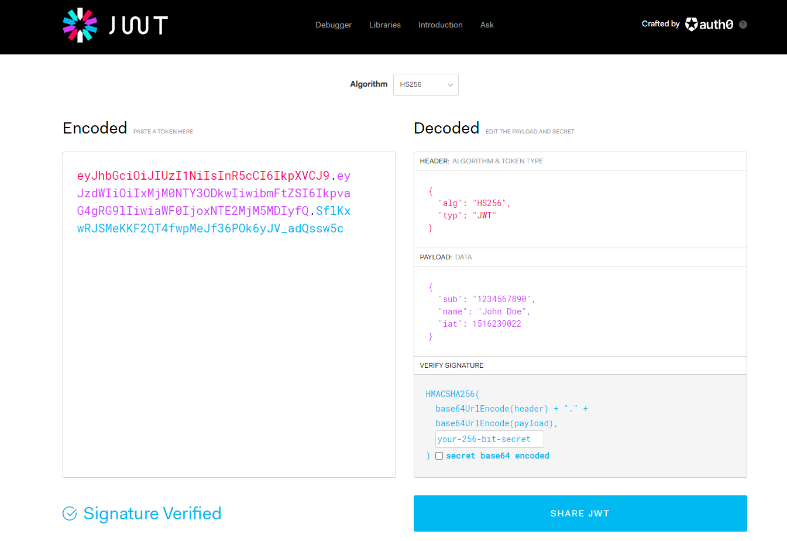

# Projeto Chapter II - Ignite - Rockeatseat
## Instalando Eslint - Prettier: 
Essas ferramentas auxiliam na padronização da escrita do código :

---

>>Guia fornecido pela Rockeatseat: 


Nesse guia você verá o passo a passo de como realizar a configuração do ESLint, Prettier e EditorConfig da mesma forma como é usado nas aulas.

Mesmo que em alguma aula você identifique que possui alguma configuração que a instrutora Daniele Leão não possui, fica tranquilo(a). Isso é porque ela foi adicionando ao longo das aulas mas eu já to te passando tudinho aqui com antecedência, beleza?

Mesmo assim, sempre que ela adicionar uma nova configuração, dá uma conferida só pra ter certeza de que você já possui ela 😉.

## Introdução

Uma ferramenta que nos auxilia no momento de padronizarmos o nosso projeto, e talvez seja a mais importante, é o **Eslint**. Com ele conseguimos automatizar os **padrões de códigos** do nosso projeto, e podemos utiliza-lo para projetos em **NodeJS, ReactJS e React Native**.

Por exemplo, no **Javascript** o uso do **ponto e vírgula** ao final de uma linha é **facultativo**, ou seja, diferente de algumas linguagens, a falta dele não interfere para que o código seja compilado. Outra utilização que também é opcional é o uso de **aspas duplas** ou **aspas simples**. 

Já quando estamos criando um objeto, o uso da **vírgula** no último item do objeto também é opcional, como podemos ver no exemplo abaixo.

```jsx
const aluno = {
  nome: "Mariana",
  idade: 20,
};
const aluno = {
  nome: "Daniel",
  idade: 21
};
```

No primeiro objeto utilizamos **vírgula** após o valor dentro do atributo **idade**, já no segundo não utilizamos, o que **não** interfere na execução do código.

O **Eslint** integra, não somente para o **VSCode,** mas também com qualquer outro tipo de editor, o que mais uma vez ajuda na padronização do código, caso um outro desenvolvedor esteja desenvolvendo no mesmo projeto, mas não queira usar o **VSCode**.

O **Prettier** é mais uma ferramenta que vamos utilizar para ajudar na padronização de código, ele consiste em várias configurações que são feitas para que o código seja formatado para seguir um padrão.

Alguns exemplos de formatações que ele faz é a quebra de linha quando ela tem mais de 80 caracteres, adicionar `;` no final das linhas dentre outras funcionalidades muito úteis para um projeto.

## Instalação

Antes de iniciar de fato a configuração do **Eslint**  em nosso projeto, precisamos instalar a **extensão** do **Eslint** no **VSCode.** É ela quem irá nos auxiliar para que nossas configurações sejam entendidas dentro do nosso código.

[ESLint - Visual Studio Marketplace](https://marketplace.visualstudio.com/items?itemName=dbaeumer.vscode-eslint)

Uma outra configuração que é geral e precisamos fazer para o **VSCode** formatar o código sempre que salvarmos algum arquivo é adicionar uma opção chamada `codeActionsOnSave` nas configurações, assim como mostrado abaixo:

```json
"editor.codeActionsOnSave": {
  "source.fixAll.eslint": true
}
```

### Eslint

Pra começar, vamos instalar o **Eslint** como uma dependência de desenvolvimento dentro do nosso projeto **NodeJS**. 

```bash
yarn add eslint -D
```

Após a instalação, precisamos inicializar o **eslint** pra conseguirmos inserir as configurações dentro do projeto.

Faremos isso inserindo o seguinte código no terminal:

```bash
yarn eslint --init
```

Ao inserir a linha acima, serão feitas algumas perguntas para configuração do projeto, conforme iremos ver à seguir:

 **1 - How would you like do use Eslint?** (Qual a forma que queremos utilizar o **Eslint**)

- **To check syntax only** ⇒ Checar somente a sintaxe
- **To check syntax and find problems** ⇒ Checar a sintaxe e encontrar problemas
- **To check syntax, find problems and enforce code style** ⇒ Checar a sintaxe, encontrar problemas e forçar um padrão de código

Nós iremos escolher a última opção `To check syntax, find problems and enforce code style`.

**2 - What type of modules does your project use?** (Qual tipo de módulo seu projeto usa?)

- **JavaScript modules (import/export)**
- **CommonsJS (require/exports)**

Como em nosso projeto estamos utilizando o **Typescript,** vamos selecionar a **primeira** opção `Javascript modules (import/export)`

**3 - Which framework does your project use?** (Qual framework seu projeto está utilizando?)

- **React**
- **Vue.JS**
- **None of these**

Como estamos configurando o nosso **backend** vamos escolher a opção `None of these`

**4 - Does your project use TypeScript?** (Seu projeto está utilizando Typescript?)

- **No**
- **Yes**

Vamos selecionar a opção `Yes`.

**5 - Where does your code run?** (Onde seu código está rodando?)

- **Browser**
- **Node**

Vamos selecionar a opção **Node**, para isso, utilizamos a tecla `Espaço` para desmarcar o **Browser** e selecionarmos a opção `Node`

**6 - How would you like to define a style for your project?** (Qual guia de estilo queremos utilizar?) 

- **Use a popular style guide ⇒** Padrões de projetos já criados anteriormente por outra empresa
- **Answer questions about your style ⇒** Criar seu próprio padrão de projeto

Vamos selecionar a primeira opção `Use a popular style guide`

**7 - Which style guide do you want to follow?** (Qual guia de estilo você deseja seguir?)

- **Airbnb: [https://github.com/airbnb/javascript](https://github.com/airbnb/javascript)**
- **Standard: [https://github.com/standard/standard](https://github.com/standard/standard)**
- **Google: [https://github.com/google/eslint-config-google](https://github.com/google/eslint-config-google)**

Nós iremos utilizar a primeira opção `Airbnb`. Com ela, nós vamos definir que nosso projeto utilizará **ponto e vírgula** ao final de cada linha, utilizará **aspas simples** e algumas outras configurações. Para saber todas as possíveis configurações, acessar a documentação da guia desejada. 
Lembrando que, não há um padrão correto, nós iremos utilizar o **Airbnb**, porém você pode utilizar qualquer guia, desde que seu time todo também esteja utilizando.

**8 - What format do you want your config file to be in?** (Qual formato de configuração do Eslint que você deseja salvar?)

- **Javascript**
- **YAML**
- **JSON**

Vamos selecionar a opção `JSON`.

Depois que respondemos as perguntas, o **ESLint** irá informar quais as dependências necessárias de acordo com a sua configuração e pedir para instalá-las automaticamente.

**9 - Would you like to install them now with npm?** (Você deseja instalar as dependências agora utilizando npm?)

 Caso estivéssemos utilizando o **NPM** a resposta seria `Yes`, mas como estamos utilizando o **Yarn** vamos responder `No` e adicionar manualmente as dependências.

```bash
Checking peerDependencies of eslint-config-airbnb@latest
The config that you've selected requires the following dependencies:

@typescript-eslint/eslint-plugin@latest eslint-config-airbnb-base@latest 
eslint@^5.16.0 || ^6.8.0 || ^7.2.0 eslint-plugin-import@^2.22.1 
@typescript-eslint/parser@latest
? **Would you like to install them now with npm?** No
```

Para adicionar manualmente as dependências, basta seguir os passos abaixo:

- Iniciar o comando com `yarn add` para instalar as dependências e a tag `-D` para adicioná-las como desenvolvimento;
- Copiar os pacotes listados [acima](https://www.notion.so/ESLint-822d59afeafc47e39527be8cabb80b00) removendo o `eslint@^5.16.0 || ^6.8.0 || ^7.2.0` pois já temos o **ESLint** instalado.

O comando final deve ter essa estrutura :

<aside>
⚠️ **Não copie o comando abaixo. Utilize isso apenas como exemplo, pois as versões podem mudar**

</aside>

```bash
yarn add -D @typescript-eslint/eslint-plugin@latest eslint-config-airbnb-base@latest eslint-plugin-import@^2.22.1 @typescript-eslint/parser@latest
```

Precisamos também instalar um plugin que irá nos auxiliar a organizar a ordem dos imports dentro dos arquivos e outro para permitir importações de arquivos TypeScript sem que precisemos passar a extensão do arquivo:

```bash
yarn add -D eslint-plugin-import-helpers eslint-import-resolver-typescript
```

Com as dependências instaladas vamos criar na raiz do projeto um arquivo `.eslintignore` com o conteúdo abaixo para ignorar o Linting em alguns arquivos:

```
/*.js
node_modules
dist
```

Agora vamos começar a configuração do arquivo que foi gerado na inicialização do **ESLint**, o `.eslintrc.json` , a primeira coisa a ser feita é adicionar dentro de `"env"` a linha:

```json
"jest": true
```

Ainda dentro de `"env"`, verifique se a primeira linha está como `"es2020": true`, caso contrário faça a alteração deixando assim.

O próximo passo é adicionar dentro de `"extends"` a linha:

```json
"plugin:@typescript-eslint/recommended"
```

Agora, precisamos configurar o plugin que instalamos para que seja usado pelo ESLint. Para isso, adicione o seguinte dentro de `"plugins"`:

```json
"eslint-plugin-import-helpers"
```

Em seguida, adicionamos dentro de `"rules"` as seguintes configurações:

```json
"camelcase": "off",
"import/no-unresolved": "error",
"@typescript-eslint/naming-convention": [
  "error",
  {
    "selector": "interface",
    "format": ["PascalCase"],
    "custom": {
      "regex": "^I[A-Z]",
      "match": true
    }
  }
],
"class-methods-use-this": "off",
"import/prefer-default-export": "off",
"no-shadow": "off",
"no-console": "off",
"no-useless-constructor": "off",
"no-empty-function": "off",
"lines-between-class-members": "off",
"import/extensions": [
  "error",
  "ignorePackages",
  {
    "ts": "never"
  }
],
"import-helpers/order-imports": [
  "warn",
  {
    "newlinesBetween": "always",
    "groups": ["module", "/^@shared/", ["parent", "sibling", "index"]],
    "alphabetize": { "order": "asc", "ignoreCase": true }
  }
],
"import/no-extraneous-dependencies": [
  "error",
  { "devDependencies": ["**/*.spec.js"] }
]
```

Por fim, para que o **Node.js** consiga entender arquivos **Typescript** é necessário acrescentar uma configuração adicional nas importações pois por padrão vai ser apresentado um erro dizendo que as importações de arquivos **Typescript** não foram resolvidas. Para resolver isso basta adicionar logo **abaixo** das `"rules"` no `.eslintrc.json` o seguinte:

```json
"settings": {
    "import/resolver": {
      "typescript": {}
    }
  }
```

Para finalizar e aplicar todas as mudanças vamos fechar o VS Code e reabrir na **pasta raiz** do projeto, pois senão o **ESLint** não vai reconhecer as dependências instaladas e aplicar as regras de Linting.

Feito isso, para verificar se está realmente funcionando basta reabrir qualquer arquivo do projeto e tentar errar algo no código para que ele mostre o erro e formate automaticamente quando o arquivo for salvo.

O arquivo `.eslintrc.json` finalizado com todas as mudanças tem que ficar assim:

```json
{
    "env": {
        "es2020": true,
        "node": true,
				"jest": true
    },
    "extends": [
        "airbnb-base",
        "plugin:@typescript-eslint/recommended"
    ],
    "parser": "@typescript-eslint/parser",
    "parserOptions": {
        "ecmaVersion": 12,
        "sourceType": "module"
    },
    "plugins": [
        "@typescript-eslint",
        "eslint-plugin-import-helpers"
    ],
    "rules": {
      "camelcase": "off",
			"import/no-unresolved": "error",
			"@typescript-eslint/naming-convention": [
			  "error",
			  {
			    "selector": "interface",
			    "format": ["PascalCase"],
			    "custom": {
			      "regex": "^I[A-Z]",
			      "match": true
			    }
			  }
			],
			"class-methods-use-this": "off",
			"import/prefer-default-export": "off",
			"no-shadow": "off",
			"no-console": "off",
			"no-useless-constructor": "off",
			"no-empty-function": "off",
			"lines-between-class-members": "off",
			"import/extensions": [
			  "error",
			  "ignorePackages",
			  {
			    "ts": "never"
			  }
			],
			"import-helpers/order-imports": [
			  "warn",
			  {
			    "newlinesBetween": "always",
			    "groups": ["module", "/^@shared/", ["parent", "sibling", "index"]],
			    "alphabetize": { "order": "asc", "ignoreCase": true }
			  }
			],
			"import/no-extraneous-dependencies": [
			  "error",
			  { "devDependencies": ["**/*.spec.js"] }
			]
    },
    "settings": {
        "import/resolver": {
            "typescript": {}
        }
    }
}
```

### Prettier

<aside>
💡 ⚠️  Antes de começar a configuração é importante que você se certifique de remover a extensão **Prettier - Code Formatter** do seu VS Code, ela pode gerar incompatibilidades com as configurações que vamos fazer.

</aside>

A primeira coisa que vamos fazer para a configuração do **Prettier** é a instalação dos pacotes no projeto, e faremos isso executando:

```bash
yarn add prettier eslint-config-prettier eslint-plugin-prettier -D
```

Esse comando vai adicionar 3 dependências que serão as responsáveis por fazer a formatação do código e também integrar o **Prettier** com o **ESLint**.

Com a instalação feita vamos modificar o arquivo `.eslintrc.json` adicionando no `"extends"` as seguintes regras:

```json
"prettier",
"plugin:prettier/recommended"
```

Nos `"plugins"` vamos adicionar apenas uma linha com:

```json
"prettier"
```

E nas `"rules"` vamos adicionar uma linha indicado para o **ESLint** mostrar todos os erros onde as regras do **Prettier** não estiverem sendo seguidas, como abaixo:

```json
"prettier/prettier": "error"
```

O arquivo final vai ficar assim:

```json
{
	...
  "extends": [
		...
    "prettier",
    "plugin:prettier/recommended"
  ],
  ...
  "plugins": [
    ...
    "prettier"
  ],
  "rules": {
    ...
		"prettier/prettier": "error"
  },
  ...
}
```

E a configuração está finalizada. Para garantir que o código seja formatado corretamente, você pode abrir os arquivos do projeto e salvar eles novamente.

# ⚠️ Problemas no Windows

É provável que você enfrente alguns problemas de conflito entre o ESLint e o tipo de quebra de linha no Windows. Isso acontece porque quando usamos a quebra de linha no Windows, ela é interpretada como `\r\n` enquanto em sistemas Unix é `\n`. Como o ESLint tenta sempre corrigir para `\n`, esse conflito acaba acontecendo.

Para padronizar o tipo de quebra de linha usada pelo VS Code no Windows, iremos instalar uma extensão chamada **[EditorConfig for VS Code](https://marketplace.visualstudio.com/items?itemName=EditorConfig.EditorConfig)**. Com ela instalada, na pasta raiz dos nossos projetos podemos clicar com o botão direito do mouse e escolher a opção `Generate .editorconfig`:


Com o arquivo criado você já está pronto para continuar. Todas as quebras de linha estarão no formato esperado pelo ESLint.

---

# Configurando Prettier
## Criar Manualmente o arquivo` prettier.config.js`**

```js

module.exports = {
  singleQuote: true,
  trailingComma: 'all',
  arrowParens: 'avoid',
};

```

Biblioteca que vai auxiliar, aqui instalada como dependência de desenvolvimento.

```bash
yarn add ts-node-dev -D

```

Lembrando de adicionar no *`package.json`* como no exemplo:

```json
"scripts": {
    "dev": "ts-node-dev --inspect --transpile-only --ignore-watch node_modules --respawn src/server.ts"
}

```

E comentar no *`tsconfig.json`* a seguinte linha

```json

"strict": true /* Enable all strict type-checking options*/

```

**Esse strict é uma opção do Javascript que faz algumas validções de erros da aplicação, mas estaremos utilizando nesse projeto o próprio typscript para sinalizar isso.**

## Configurando o Debbug

Indo na parte de depuração do VS CODE :

 

e configurando no *`lauch.json`*

```json

{
    // Use o IntelliSense para saber mais sobre os atributos possíveis.
    // Focalizar para exibir as descrições dos atributos existentes.
    // Para obter mais informações, acesse: https://go.microsoft.com/fwlink/?linkid=830387
    "version": "0.2.0",
    "configurations": [
        {
            "type": "node",
            "request": "attach",
            "name": "Launch Program",
            "skipFiles": [
                "<node_internals>/**"
            ],
            "outFiles": [
                "${workspaceFolder}/**/*.js"
            ]
        }
    ]
}

```

E concluindo para que a conseguir se conectar com a aplicação e executar o debugger com sucesso adicionar ao *`package.json`* a **tag `--inspect`** ficando o script assim:

```json
"scripts": {
    "dev": "ts-node-dev --inspect --transpile-only --ignore-watch node_modules --respawn src/server.ts"
},

```

---

# Diagrama da aplicação desse projeto de estudo:



---
## Utilizando UUID - Identificador Unico Universal

Estaremos utilizando a biblioteca *`uuid`* para geração do id:

[Documentação UUID](https://www.npmjs.com/package/uuid)

Intalação :

```properties bash

yarn add uuid

yarn add @types/uuid -D

```

>> Repositories responsável pela manipulação e persistência dos dados : Rota chama o repositório e o repositório retorna a resposta que ela precisa.

---
## Tipo de retorno no TypeScript

Passar o tipo de retorno de uma função no typescript aqui mostrado no `create({ description, name }: ICreateCategoryDTO)`: **`void`**:

```ts
create({ description, name }: ICreateCategoryDTO): void {
		const category = new Category();

		Object.assign(category, {
			name,
			description,
			created_at: new Date(),
		});

		this.categories.push(category);
	}

```
---
# Recaptulando algo importante da orientação à objetos para o `Typescript:`

##  A Diferença de **`classe`**, **`objeto`** e **`instância`** :
##  instância é a "materialização" da classe, o que gera um objeto na memória!


---
## Principios de S.O.L.I.D.

>> Arquitetura, código Limpo => Informações claras e bem definidas, padrões de organização de projetos, bom para projetos escaláveis.

[>>Sobre Uncle Bob<<](https://pt.wikipedia.org/wiki/Robert_Cecil_Martin)

**`S`** => **SRP** - Single Responsability Principle (Princípio da Responsabilidade Única) 
* Deixar nas rotas somente o que for responsabilidade atribuída à elas, sempre avaliando o contexto da necessidade do endpoint; Receber a requisição, processar e retornar resposta.

**`O`** => **OCP** - Open-Closed Principle (Princípio aberto/fechado)

**`L`** => **LSP** - Liskov Substituition Principle (Princípio de Substituição de Liskov)
* Bárbara Liskov - Se você tem uma Classe S e essa Classe é um subtipo de T, então todos os objetos do tipo T dentro de um programa podem ser substituídos pelos objetos do tipo S sem que isso afete a execução correta do programa.
  
**`I`** => **ISP** - Interface Segregation Principle (Princípio da Segregação de Interface)

**`D`** => **DIP** - Dependency Inversion Principle (Princípio da Inversão de Dependência)
* O código que implementa uma política de alto nível(camada mais próxima ao domínio) não deve depender do código que implementa detalhes de baixo nível(rotas, mais perto do usuário)

---

### Singleton Pattern
* Tem como definição criar apenas um instância de uma classe que será um instância global para a aplicação.
* Toda vez que a gente chamar essa classe, ela ira utilizar a mesma instância da classe.
* >> Verificar a necessidade de se ter somente uma instância!

### Biblioteca Multer
[Documentação](https://www.npmjs.com/package/multer)

* Serve para fazer a leitura de arquivos dentro da aplicação, através do upload do arquivo.
* Nessa aplicação vamos pegar o arquivo de categorias recebido por upload, armazenar em uma pasta temporária pra fazer a leitura dos dados do arquivo e depois faz a deleção.

adicionar a dependência

```properties bash

yarn add multer

```

adicionar os tipos do multer ao express para o intelisense do VS Code fazer o autocomplete:

```properties bash

yarn add @types/multer -D

```


>>**No retorno do post de importação de arquivos é uma boa prática retornar a URL no corpo da requisição assim seu front não vai precisar fazer uma request numa api get pra pegar essa info!**

### Biblioteca csv-parser
[Documentação](https://www.npmjs.com/package/csv-parser)

* Tem funcionalidades já implementadas que facilitam a leitura do arquivo no formato csv

```properties bash

yarn add csv-parse

```

---

## Conceito de Stream no Node.JS
* Permite que seja lido determinado arquivo `by chuncks`, "por partes".
  
* Chunk: um Buffer que representa os dados que estão chegando

>> Pensar no Netflix, Youtube...O servidor envio o pedaço do nosso vídeo aos poucos para o player, isso faz com que o consumo de banda seja menor, o consumo de dados seja menor, melhora a performance no consumo de memória do servidor, isso com a leitura das informações por partes.

Ver mais informações sobre Stream no Node.JS [>>aqui!](https://nodejs.reativa.dev/0052-nodejs-streams/index)

# Swagger - auxilia na documentação da aplicação
Utilizando a [biblioteca swagger-ui-express](https://www.npmjs.com/package/swagger-ui-express):

```properties bash

yarn add swagger-ui-express

yarn add @types/swagger-ui-express -D

```
 
## Para importar e subir um servidor do swagger : 

* Importar o arquivo e subir o servidor na rota `"/api-docs"`

```ts
import swaggerFile from './swagger.json';

app.use('/api-docs', swaggerUi.serve, swaggerUi.setup(swaggerFile));

```


E para corrigir o erro da importação caso ele ocorra, descomentar a linha  no `tsconfig.json` 

```json
 
 "resolveJsonModule": true,                        /* Enable importing .json files */

```



* criar um arquivo no diretório src : `swagger.json`
  
```json
{
  "openapi": "3.0.1",
  "info": {
    "title": "RentaLX Documentation",
    "description": "This is an API Rent",
    "version": "1.0.0",
    "contact": {
      "email": "donatello@catiorro.com"
    }
  }
}

```
Acessando no **http://localhost:3333/api-docs/**



---
# Conhecendo TSyringe
Auxilia na injeção de dependências na aplicação
[Documentação TSyringe](https://github.com/microsoft/tsyringe)

## Instalação:

```properties bash

npm install --save tsyringe / yarn add tsyringe

```
* Modificar o tsconfig.json

```json
{
  "compilerOptions": {
    "experimentalDecorators": true,
    "emitDecoratorMetadata": true
  }
}

```
* Caso não tenha instalado o reflect-metadata:
  
```properties bash

yarn add reflect-medatada

```
* Importação: 

```ts
// main.ts
import "reflect-metadata";

// Your code here...
```

# Utilizar BCryptjs para criptografia de senhas:

>> ⚠️ PS : Bcrypt deu treta com o container no Docker

```properties bash

yarn add bcryptjs

```
* Adicionar tipagens
```properties bash

yarn add @types/bcryptjs -D

```


* import no usecase 
```ts

import { hash } from 'bcryptjs';

```

# JWT Json Web Token - Autenticação de usuários
A aplicação vai ter uma rota de sessão onde o usuário vai passar as informações do email e da senha, a gente vai validar o cadastro e a senha se estão corretos e gera um token para o usuário.
Em todas as sessões o usuário vai precisar passar esse token para validar se o usuário está qualificado para a operação que está sendo solicitada.
Ex: Token que vai garantir que usuário que está cadastrando uma categoria está apto para isso, seja administrador.

A estrutura do JWT é dividida em três partes : `Header`(Algoritmo e tipo de token), `Payload`(Data) e `Verify Signature`:

* ⚠️ Importante não passar dados críticos no payload




[Documentação JWT](https://jwt.io/)

* Adicinando JWS à aplicação: 

```properties bash

yarn add jsonwebtoken

yarn add @types/jsonwebtoken -D

```

[Ver também MD5 hash generator](https://www.md5hashgenerator.com/) 

## Lib Errors:

```properties bash

yarn add express-async-errors

```
* Importação após express no server.ts:

```ts

import 'express-async-errors';

```


 